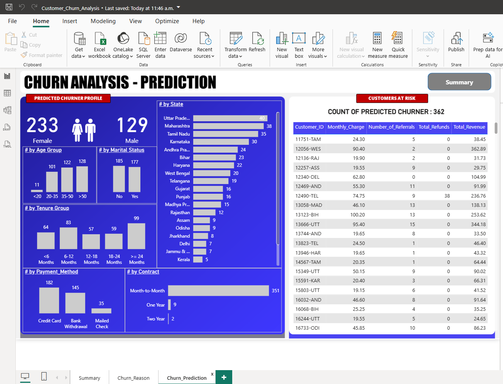
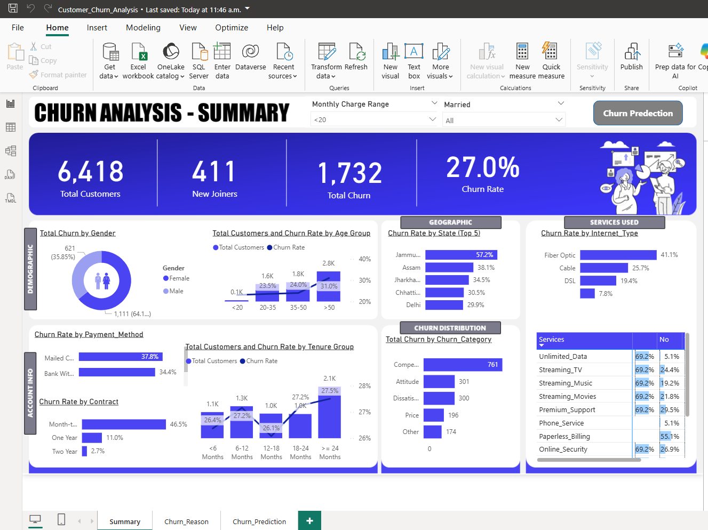

# Customer Churn Analysis – SQL, Python, Power BI & Docker

This end-to-end project focuses on analyzing customer churn behavior using real-world business questions, cleaning and transforming data with SQL (PostgreSQL via DBeaver), applying machine learning models in Python, and visualizing key insights using Power BI. The project also includes Docker compatibility for environment replication.

---

## Project Objectives

- Understand the distribution of customers by gender, contract type, and geography.
- Identify revenue contribution from different customer segments.
- Build a machine learning model to predict customer churn.
- Deploy insights via an interactive Power BI dashboard.
- Demonstrate SQL, Python, and Power BI integration in a single analytics pipeline.

---

## Tools & Technologies

- **SQL (PostgreSQL via DBeaver)**
- **Python (VS Code, pandas, scikit-learn, matplotlib)**
- **Power BI Desktop + Power BI Service**
- **GitHub**
- **Docker** (for replicable environment setup)

---

## Project Structure

```
CHURN_ANALYSIS/
│
├── Dashboard/
│   └── Customer_Churn_Analysis.pbix
│
├── data/
│   ├── cleaned_prediction_data.xlsx
│   └── original_customer_data.csv
│
├── docs/
│   ├── customer_churn_analysis(SQL).pdf
│   └── screenshots/
│       ├── churn_analysis_summary.png
│       └── churn_prediction.png
│
├── notebooks/
│   └── churn_model_and_prediction.ipynb
│
├── prediction_outputs/
│   └── predicted_churned_customers.csv
│
├── SQL/
│   ├── create_churn_views.sql
│   ├── create_cleaned_churn_table-2.sql
│   ├── exploratory_churn_analysis.sql
│   └── missing_value_summary.sql
│
└── README.md
```

---

## Key Business Questions Solved

> See full details in: [`docs/customer_churn_analysis(SQL).pdf`](docs/customer_churn_analysis(SQL).pdf)

1. **Gender distribution of customers**
2. **Contract types and distribution**
3. **Customer status vs revenue contribution**
4. **Top 10 states by customer base**
5. **NULL value count across all columns**

---

## Data Cleaning & Transformation (SQL)

- NULL handling using `COALESCE()`
- Creation of `prod_churn` table
- Views:
  - `vw_churndata`: Churned & Stayed
  - `vw_joindata`: Joined customers

---

## Machine Learning Model (Python)

Implemented in: [`notebooks/churn_model_and_prediction.ipynb`](notebooks/churn_model_and_prediction.ipynb)

- RandomForestClassifier model
- Label Encoding
- Train/Test Split
- Confusion Matrix & Classification Report
- Feature Importance Plot

🖼️ **Churn Prediction Overview**



🖼️ **Feature Importance Summary**



---

## Dashboard (Power BI)

📁 File: [`Customer_Churn_Analysis.pbix`](Dashboard/Customer_Churn_Analysis.pbix)

- KPIs: Total Customers, Revenue by Status
- Visuals: Gender, Contract Type, State, Churn Rate
- Slicers and dynamic interactions

➡️ **Live Dashboard Link**: [View on Power BI](https://app.powerbi.com/view?r=eyJrIjoiNzQ1Yjk1YmUtZTU4OC00OThjLWE2NjUtYjE0NDgyMDhjMzI2IiwidCI6ImI2NDE3Y2QwLTFmNzMtNDQ3MS05YTM5LTIwOTUzODIyYTM0YSIsImMiOjN9)

---

## Docker (Optional Setup)

To enable reproducibility using Docker, create the following `Dockerfile`:

```Dockerfile
FROM python:3.10

WORKDIR /app

COPY . /app
RUN pip install -r requirements.txt

CMD ["jupyter", "notebook", "--ip=0.0.0.0", "--port=8888", "--allow-root"]
```

Add a `requirements.txt` file:

```txt
pandas
scikit-learn
matplotlib
seaborn
openpyxl
```

Build and run:

```bash
docker build -t churn-analysis .
docker run -p 8888:8888 churn-analysis
```

---

## Results & Insights

- **Stayed customers** contribute 82% of total revenue.
- **Churned customers** made up 17.5% revenue before exit.
- Top predictors: `Contract`, `Total Charges`, `Tenure`.
- Actionable segmentation via Power BI.

---

## Learnings

- End-to-end business pipeline design
- SQL for data prep + Python for ML + BI for storytelling
- Real-world feature engineering and NULL handling
- Deployment and documentation via Git & GitHub

---

## Credits & Contact

Created by **Prabesh Rai**

📧 [Email](raiprabesh775@gmail.com)
🔗 [LinkedIn](https://www.linkedin.com/in/prabeshrai/)  
🐙 [GitHub](https://github.com/Prabesh789)

---
## Acknowledgments

This project was built as part of my self-learning journey.

Parts of the implementation (e.g., Python modeling, Power BI structure) were inspired by public tutorials and walkthroughs. Special thanks to the tutorial creators and the broader data community for guidance and resources.

> Note: All SQL logic, model tuning, and business question alignment were customized and extended to reflect my own understanding and objectives.
---